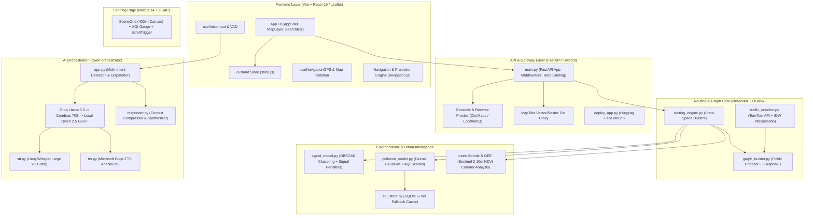
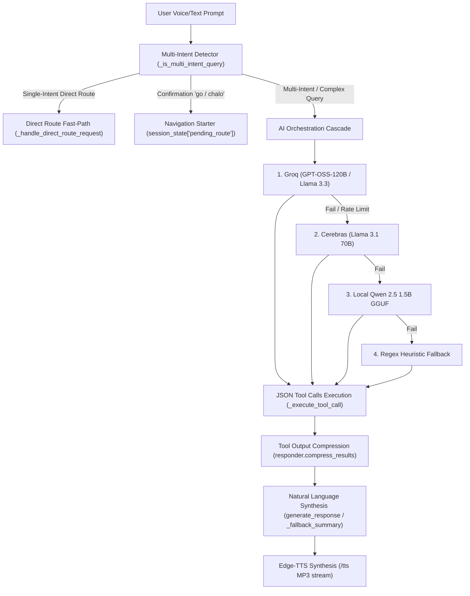

# EUDORA: The Complete Codebase & Architectural Guide

Welcome to the definitive, line-by-line, and concept-by-concept architectural guide to **EUDORA** (*Eco-Urban Dynamic Optimization & Routing Architecture*).

EUDORA is a multi-objective, hyper-localized navigation and conversational AI engine engineered specifically for **Indore, Madhya Pradesh, India** (India's cleanest city). Standard global GPS platforms (such as Google Maps) optimize purely for travel time or distance under Western road paradigms. EUDORA fundamentally rethinks navigation for Indian urban realities by modeling:

1. **Traffic Signal Stoppage Penalties** (signals spaced 200–400m apart).
2. **Direction-Aware Free Left Turns** (in left-hand drive India, left turns skip traffic lights; right turns cross oncoming lanes).
3. **Hyper-Local Air Quality Exposure (AQI)** (avoiding industrial belts and congested NH-52 / Ring Road corridors).
4. **Urban Heat Stress & Sentinel-2 Satellite Tree Canopy Density (NDVI)**.
5. **Road Hierarchy Penalties** (discouraging narrow residential gulleys in favor of arterials).
6. **Multi-Tier Conversational Voice AI Orchestration** (Groq, Cerebras, Local Qwen 2.5 GGUF, Whisper STT, and Edge-TTS).

---

## High-Level System Architecture



---

## 1. Multi-Objective Routing Profiles & Mathematical Cost Functions

When a user requests directions between coordinates in Indore, EUDORA's `backend/api/routes.py` calculates **5 distinct routes** in parallel using directional state-space Dijkstra pathfinding.

The general edge cost function $C(e)$ evaluated along movement $(prev \to curr \to next)$ is:

$$C(e) = w_{\text{time}} \cdot T_{\text{live}} + w_{\text{signal}} \cdot D_{\text{signal}} + w_{\text{hierarchy}} \cdot P_{\text{road}} + w_{\text{pollution}} \cdot D_{\text{pollution}} + w_{\text{turn}} \cdot P_{\text{turn}}$$

### Profile Weight Matrix & Budget Ceilings

| Route Profile | $w_{\text{time}}$ | $w_{\text{signal}}$ | $w_{\text{turn}}$ | $w_{\text{hierarchy}}$ | $w_{\text{pollution}}$ | Distance Budget Ceiling | Primary Objective |
| :--- | :---: | :---: | :---: | :---: | :---: | :---: | :--- |
| ⚡ **Fastest** | `1.0` | `0.0` | `0.0` | `0.3` | `0.0` | None (Baseline $D_0$) | Pure minimal travel time |
| 🚦 **Least Signals** | `0.5` | `8.0` | `0.6` | `0.0` | `0.1` | $\le 1.8 \times D_0$ | Minimizes traffic light stops |
| 🛡️ **Cleanest Air** | `0.3` | `0.5` | `0.3` | `0.0` | `8.0` | $\le 1.8 \times D_0$ | Minimizes particulate exposure |
| ⭐ **Overall Best** | `1.0` | `1.5` | `0.6` | `0.5` | `1.5` | $\le 1.5 \times D_0$ | Optimal balance across all metrics |
| 🌳 **Greenest** | — | — | — | — | — | $\le 1.5 \times D_0$ | Maximizes Sentinel-2 tree canopy coverage |

*Note on Greenest Route:* Evaluated with a specialized edge cost:
$$W_{\text{green}}(e) = \text{length}(e) \times (1.0 + \text{tree\_cost}(e)) = \text{length}(e) \times (2.0 - \text{canopy\_score}(e))$$

---

## 2. Deep-Dive: Backend Core & Gateway

### `main.py` — Primary Application Server
This is the root FastAPI application server.

- **`SecurityHeadersMiddleware`**: Injects security headers (`X-Content-Type-Options: nosniff`, `X-Frame-Options: DENY`, `Referrer-Policy: strict-origin-when-cross-origin`, `Permissions-Policy: geolocation=(self), microphone=(self), camera=()`, `X-XSS-Protection: 1; mode=block`).
- **`RequestSizeLimitMiddleware`**: Inspects `content-length` and rejects payloads $> 10\text{MB}$ (HTTP 413).
- **`lifespan(app: FastAPI)`**: Async context manager executing startup and shutdown lifecycle:
  1. `_validate_env_vars()`: Verifies TomTom, LocationIQ, MapTiler, OWM, Ola Maps keys.
  2. `_initialize_earth_engine()`: Non-blocking Google Earth Engine initialization.
  3. `build_graph("indore.graphml")`: Loads road network (Pickle cache $\to$ GraphML).
  4. `_load_canopy_store()`: Reads `data/canopy_scores.json`.
  5. `SignalModel.attach_signal_weights()`: Attaches signal delays to edges.
  6. `PollutionModel.attach_pollution_weights()`: Attaches emission factors to edges.
  7. `TrafficEnricher.enrich()` & `run_scheduler()`: Launches TomTom background sync.
- **`GET /health`**: Reports uptime, graph node/edge counts, API connectivity.
- **`GET /api/geocode`**: Rate-limited (30/min) place search (Ola Maps with LocationIQ fallback).
- **`GET /api/reverse`**: Rate-limited (30/min) reverse geocoder (Ola Maps with LocationIQ fallback).
- **`GET /api/tiles/{style}/{z}/{x}/{y}.png`**: Rate-limited (120/min) cached MapTiler proxy hiding API keys and injecting 24-hour browser caching headers.

### `backend/api/routes.py` — Routing & Signal REST Endpoints
- **`get_client_ip(request: Request) -> str`**: Parses `x-forwarded-for` header for rate limiting.
- **`_in_indore(lat, lng) -> bool`**: Enforces Indore geographic bounding box:
  $$\text{Lat} \in [22.25, 23.15], \quad \text{Lng} \in [75.45, 76.35]$$
- **`route_to_geojson(G, route) -> dict`**: Transforms list of node IDs into standard GeoJSON `LineString`.
- **`extract_signal_coords(G, route) -> list[dict]`**: Extracts coordinates of all unique signaled junctions encountered along the path.
- **`build_response(G, result, pollution_model) -> dict`**: Formats GeoJSON geometry, distance (km), ETA (min), signal count, signal coordinates, AQI score, and AQI verbal label.
- **`GET /api/get-routes`**: Rate limited to 5/min. Computes all 5 routes and applies distance budgets.
- **`GET /api/get-signals`**: Returns all clustered junction coordinates for map rendering.

### `deploy_app.py` — Production Deployment Hub
Loads `main:app` and dynamically mounts the `qwen-orchestrator` FastAPI sub-application under the `/orchestrator` sub-path for unified container deployment on Hugging Face Spaces.

---

## 3. Deep-Dive: Routing Engine Subsystem

```
backend/routing/
├── geometry.py          (High-fidelity road geometry extraction, orientation, & GeoJSON reconstruction)
├── graph_builder.py     (Graph construction, sanitization, speed models, and caching)
├── routing_engine.py    (Directional state-space Dijkstra with predecessor map)
└── traffic_enricher.py  (TomTom Traffic Flow live speeds & IDW spatial interpolation)
```

### `backend/routing/graph_builder.py`
Constructs and caches the Indore road network graph ($G$):
1. **Three-Tier Loading Architecture**:
   - *Tier 1 (Fast Path)*: Deserializes `indore.pkl` using Python `pickle` Protocol 5 (loads in ~1–2 seconds).
   - *Tier 2 (Fallback)*: Parses `indore.graphml` via OSMnx, sanitizes attributes, and saves `.pkl` for subsequent runs.
   - *Tier 3 (Cold Start)*: Downloads Indore driving network via `ox.graph_from_place("Indore, Madhya Pradesh, India")`.
2. **Speed & Attribute Assignment**:
   - `_road_speed(data)`: Maps OSM `highway` tags to realistic Indian driving speeds:
     - `motorway`: 65 km/h, `trunk`: 45 km/h, `primary`: 25 km/h, `secondary`: 20 km/h, `residential`: 14 km/h, `living_street`: 10 km/h.
   - `_compute_edge_times(G)`: Computes $\text{base\_time} = (\text{length\_km} / \text{speed}) \times 60$.
   - **Road Hierarchy Penalty**: Assigns $P_{\text{road}} = 0.0$ min to arterial roads and $0.8$ min to minor/residential streets.

### `backend/routing/routing_engine.py`
Implements state-space directional Dijkstra:

```
State-Space Node Representation: (prev_node, curr_node)
Priority Queue Tuple: (cost, monotonic_seq, prev_node, curr_node, accumulated_dist)
Predecessor Map: prev_map[(prev, curr)] = (prev_prev, prev)
```

1. **`turn_penalty(G, A, B, C) -> float`**:
   - Constructs vectors $\vec{v}_1 = B - A$ and $\vec{v}_2 = C - B$.
   - Computes turn angle $\theta = \arccos\left(\frac{\vec{v}_1 \cdot \vec{v}_2}{|\vec{v}_1||\vec{v}_2|}\right)$.
   - Assigns base penalty: $< 25^\circ \to 0.0\text{m}$, $25^\circ–80^\circ \to 0.3\text{m}$, $80^\circ–140^\circ \to 0.8\text{m}$, $\ge 140^\circ \to 1.5\text{m}$.
   - **Indian Traffic Right-Turn Surcharge**:
     $$\text{cross} = v_{1,lat} v_{2,lon} - v_{1,lon} v_{2,lat}$$
     If $\text{cross} < 0$ (right turn crossing oncoming traffic), penalty is multiplied by $1.2$ (+20%).
2. **`_is_left_turn(G, A, B, C) -> bool`**:
   - Returns `True` if $\theta \ge 25^\circ$ and $\text{cross} > 0$.
   - **Free Left Turn Bypass**: In India, vehicles turning left at an intersection slip through without waiting for the traffic light. The engine sets $D_{\text{signal}} = 0$ for free left turns!
3. **`weighted_directional_route(...)` & `greenest_directional_route(...)`**:
   - Executes Dijkstra with $O(E \log E)$ memory using predecessor backtracking, pruning paths that exceed `max_distance_m`.

### `backend/routing/traffic_enricher.py`
Integrates real-time traffic speeds from the TomTom Traffic Flow API:
1. **Strategic Probe Selection**: Identifies up to 150 probe points across 16 major Indore corridors (A.B. Road, Ring Road, MR-10, Bypass, Nemawar Road, Airport Road, etc.) spaced $\ge 400\text{m}$ apart.
2. **Inverse Distance Weighting (IDW)**:
   For every edge midpoint within radius $R = 800\text{m}$ of probe points:
   $$w_i = \left(\frac{1.0}{\max(d_i, 1.0)}\right)^2, \quad \bar{v}_{\text{curr}} = \frac{\sum w_i v_i}{\sum w_i}, \quad \bar{c} = \frac{\sum w_i c_i}{\sum w_i}$$
3. **Coupled Non-Linear Emission Factor**:
   $$\text{emission\_factor} = \frac{1.0}{\max(\bar{c}, 0.15)^{0.7}}$$
   Updates `traffic_factor` and `live_time` across graph edges.
4. **IST Rush-Hour Cron Scheduler**:
   Asynchronously refreshes traffic at 5 key inflection points: 1:00 AM, 9:00 AM, 2:00 PM, 5:00 PM, and 8:00 PM IST with an 8-hour disk cache fallback.

---

## 4. Deep-Dive: Traffic Signal Modeling

```
backend/signal/
├── signal_model.py          (DBSCAN clustering, geometric point-to-segment distance, delay injection)
├── export_osm_signals.py    (CLI tool extracting OSM traffic_signals to JSON registry)
└── visualize_all_signals.py (Folium Leaflet visualizer differentiating manual vs OSM signals)
```

### `backend/signal/signal_model.py`
- **`_fast_dist_m(lat1, lon1, lat2, lon2) -> float`**: High-speed equirectangular approximation ($\Delta lat \times 111320, \Delta lon \times 111320 \cos(lat)$) avoiding expensive trigonometric calls.
- **`_load_and_cluster_signals(self)`**: Reads `data/signals_registry.json`. Groups proximate signals within `cluster_radius = 90m` into unified junction centroids (averaging coordinates).
- **`_point_to_segment_dist(plat, plng, alat, alng, blat, blng) -> float`**: Projects junction point $P$ onto segment $AB$ in local Cartesian meters, calculating exact perpendicular distance.
- **`attach_signal_weights(self)`**:
  - Finds all graph nodes within `detection_radius = 150m` of a junction.
  - Injects `signal_presence = 1`, `junction_id`, and `signal_delay = stop_prob * (avg_wait / 60) = 0.85 \times (75 / 60) \approx 1.06\text{ min}` onto incoming edges.

---

## 5. Deep-Dive: Urban Pollution & Dynamic AQI Subsystem

```
backend/pollution/
└── pollution_model.py   (PollutionModel v2, Gaussian diurnal rush-hour curve, exposure metrics)
backend/data/
├── aqi_store.py         (SQLite 5-tier fallback caching system)
└── seed_aqi.py          (168-hour weekly synthetic data seeder for Indore)
```

### `backend/pollution/pollution_model.py`
1. **Diurnal Time Multiplier ($t_{\text{mult}}$)**:
   $$t_{\text{mult}}(\text{hour}) = \text{clamp}\Big(0.55 + 2.0 \cdot G(\text{hour}, 8.5, 1.2) + 2.0 \cdot G(\text{hour}, 17.5, 1.3) + 0.5 \cdot G(\text{hour}, 13.0, 0.8), \, 0.5, \, 2.5\Big)$$
   where $G(x, \mu, \sigma) = \exp\left(-0.5 \left(\frac{x - \mu}{\sigma}\right)^2\right)$. Accurately models morning rush (8:30 AM), evening rush (5:30 PM), and afternoon traffic in Indore.
2. **Intersection Complexity Factor**:
   $$\text{deg} = \frac{\text{deg}(u) + \text{deg}(v)}{2.0}, \quad f_{\text{intersection}} = \text{clamp}\left(0.8 + (\text{deg} - 2.0) \times \frac{1.2}{6.0}, \, 0.8, \, 2.0\right)$$
3. **Edge Exposure & Delay Calculation**:
   $$\text{exposure}(e) = \text{vol}(e) \times f_{\text{intersection}} \times (\text{has\_signal} ? 1.5 : 1.0) \times t_{\text{mult}} \times \text{length\_km}$$
   $$\text{pollution\_delay}(e) = \frac{\text{exposure}(e)}{\max(\text{exposures})} \times 10.0$$

### `backend/data/aqi_store.py` — 5-Tier Fallback Hierarchy
1. **Tier 1 (Historical Slot Average)**: If `aqi_hourly_avg` for `(day_of_week, hour)` has $\ge 3$ samples, returns cached historical average.
2. **Tier 2 (In-Memory Live Cache)**: Returns cached API reading if age $< 2\text{ hours}$ (7200s).
3. **Tier 3 (Live OpenWeatherMap API)**: Queries OWM Air Pollution API for Indore $(22.7196, 75.8577)$ and persists reading to SQLite database `data/aqi_history.db`.
4. **Tier 4 (Sparse Historical Average)**: Uses slot average with $< 3$ samples.
5. **Tier 5 (Hard Fallback)**: Returns default AQI 3 (Moderate).

---

## 6. Deep-Dive: Sentinel-2 Satellite Tree Canopy & NDVI Engine

```
backend/trees/
├── gee_fetch.py             (Google Earth Engine Sentinel-2 NDVI raster fetcher)
├── canopy.py                (NDVI thresholding & classification)
├── tree_store.py            (Atomic JSON persistence for canopy scores)
├── tree_cost.py             (Canopy routing cost computation & cache singleton)
└── precompute.py            (Batch offline canopy precomputation script)
generate_canopy_blobs.py     (Extracts top 3,000 canopy centroids for frontend heatmap overlays)
```

1. **Earth Engine Pipeline (`gee_fetch.py`)**:
   - Takes route coordinate sequences and builds a 25-meter buffered corridor geometry (`line.buffer(25)`).
   - Queries `COPERNICUS/S2_SR_HARMONIZED` (Sentinel-2 Level-2A surface reflectance) filtered by cloud percentage $< 20\%$.
   - Computes 10m-resolution Normalized Difference Vegetation Index:
     $$\text{NDVI} = \frac{\text{B8 (NIR)} - \text{B4 (Red)}}{\text{B8 (NIR)} + \text{B4 (Red)}}$$
2. **Canopy Scoring (`canopy.py`)**:
   $$\text{score} = \frac{\sum (\text{valid pixels with } \text{NDVI} > 0.4)}{\text{total valid non-NaN pixels}}$$
   Categorizes into labels: `bare` ($<0.1$), `sparse` ($0.1–0.3$), `moderate` ($0.3–0.6$), `dense` ($>0.6$).
3. **Precomputed Registry**: `data/canopy_scores.json` contains 173,309 precomputed segment keys (`u_v_k`).

---

## 7. Deep-Dive: Qwen Voice AI Orchestrator Subsystem

```
qwen-orchestrator/
├── app.py                   (FastAPI entrypoint, multi-intent detection, direct-route bypass, tool executor)
├── groq_orchestrator.py     (Groq cloud inference: GPT-OSS-120B / Llama 3.3 70B)
├── cerebras_orchestrator.py (Cerebras cloud inference: Llama 3.1 70B)
├── orchestrator.py          (Local GGUF llama-cpp-python Qwen 2.5 1.5B router)
├── responder.py             (Context compression & conversational response synthesizer)
├── tool.py                  (Async wrappers for routes, geocoding, signals, weather, places, fuel costs)
├── stt.py                   (Groq Whisper Large v3 Turbo transcription)
└── tts.py                   (Microsoft Edge-TTS en-US-AriaNeural synthesizer + Pygame playback)
```

### Multi-Tiered AI Cascade & Intent Routing Flow



### Key Tool Ecosystem (`tool.py`)
- `get_routes(origin_lat, origin_lon, dest_lat, dest_lon)`: Dispatches to backend routing engine.
- `geocode(query)` / `reverse_geocode(lat, lon)`: Location resolution.
- `get_weather(lat, lon)` / `get_air_quality(lat, lon)`: OpenWeatherMap queries.
- `get_nearby_places(lat, lon, types, radius)`: Ola Maps advanced nearby search.
- `calculate_fuel_cost(distance_km, fuel_price, mileage)`: Computes INR fuel cost based on Indore petrol rates.

---

## 8. Deep-Dive: Interactive Frontend (React 19 + Vite + Leaflet)

```
frontend/src/
├── main.jsx                 (React 19 entrypoint)
├── App.jsx                  (Root shell, theme synchronization, navigation header/cards toggle)
├── api.js                   (HTTP/REST client with timeout abort controllers & blob handlers)
├── config.js                (Host detection, API base resolution, route colors & names)
├── store.js                 (Zustand centralized global state store)
├── components/              (15 modular UI components)
├── hooks/                   (5 custom React hooks for GPS, Voice, Routes, Geocoding)
├── utils/navigation.js      (Haversine, bearing, route snapping, instruction generator)
└── styles/                  (Design system, glassmorphic themes, animations)
```

### State Store Architecture (`store.js`)
- **Waypoints**: `origin`, `destination` (`{ lat, lng, label }`).
- **Modes**: `mode` (`"hands-on"` | `"ai"`), `theme` (`"dark"` | `"light"`).
- **Active Navigation**: `isNavigating`, `navInstructions`, `currentNavStep`, `userLocation` (`{ lat, lng, heading, speed }`).
- **Voice & AI**: `chatMessages`, `isListening`, `isLoading`.

### Custom Navigation Hooks
1. `useVoiceInput.js`: Dual-stream voice capture. Runs Web Audio API Voice Activity Detection (RMS energy monitoring, 2.3s start silence / 0.9s end silence timeouts) alongside Web Speech API and `MediaRecorder`. Sends audio blobs to Groq Whisper STT.
2. `useNavigationGPS.js`: Live GPS tracker via `navigator.geolocation.watchPosition` (`enableHighAccuracy: true`). Snaps raw GPS readings to the active route polyline via `findClosestPointOnRoute`, computes off-route distance, and auto-advances turn steps when within 25m of a junction waypoint.
3. `useMockGPS.js`: 15 m/s simulator interpolating coordinates along route polylines for testing without driving.

### UI Components Overview
- `MapLayer.jsx`: Leaflet map rendering MapTiler tiles with CartoDB fallback. Contains `NavigationController` which dynamically rotates the map canvas based on user heading (`rotate(${360 - heading}deg)`).
- `AIPanel.jsx`: Voice-activated conversational AI drawer with live waveform visualizer, audio recorder, and auto-start navigation confirmation.
- `RouteCards.jsx`: Glassmorphic cards displaying route metrics (time, km, signals, AQI) with animated selection stripes.
- `AnimatedPolyline.jsx`: RequestAnimationFrame cubic ease-out route tracing animation on map load.

---

## 9. Deep-Dive: Next.js Landing Page (`eudora-landing`)

```
eudora-landing/src/
├── app/
│   ├── layout.tsx           (Google Font Outfit, Next.js metadata)
│   ├── page.tsx             (Composition of all 8 storytelling sections)
│   └── globals.css          (Tailwind styling, custom scrollbars, selection colors)
└── components/
    ├── SceneOne.tsx         (400vh scroll-driven canvas rendering 48 pre-decoded ImageBitmaps)
    ├── ProblemSection.tsx   (GSAP ScrollTrigger staggered reveals of Indore commute friction)
    ├── SolutionSection.tsx  (Hyper-local routing philosophy statement)
    ├── SignalsSection.tsx   (Animated SVG traffic light pole with pulsing red lamp)
    ├── PollutionSection.tsx (HiDPI HTML5 Canvas dynamic AQI gauge with physics needle)
    ├── RoutesSection.tsx    (4-card grid: Fastest, Cleanest Air, Least Signals, Best Overall)
    ├── StatsSection.tsx     (Scroll-triggered numeric count-up animations)
    ├── CtaSection.tsx       (Floating ambient gradient orbs with glass CTA card)
    ├── Navbar.tsx           (Sticky glass nav with ScrollTrigger section tracking)
    └── Footer.tsx           (Responsive 3-column footer)
```

---

## 10. Complete File & Symbol Index

```
EUDORA/
├── Dockerfile                           -> Debian Python 3.11 container with C++ & libspatialindex-dev
├── README.md                            -> Full project documentation & Hugging Face YAML metadata
├── CODEBASE_GUIDE.md                    -> Exhaustive architectural and technical specification
├── deploy_app.py                        -> Hugging Face Spaces entrypoint mounting /orchestrator
├── main.py                              -> Core FastAPI application, security middlewares, proxies
├── generate_canopy_blobs.py             -> Centroid extractor for top 3000 high-canopy road segments
├── requirements.txt                     -> Full backend dependencies manifest
├── backend/
│   ├── api/
│   │   ├── routes.py                    -> /api/get-routes & /api/get-signals endpoints
│   │   └── server.py                    -> Backward-compatible ASGI export
│   ├── data/
│   │   ├── aqi_store.py                 -> SQLite 5-tier fallback AQI caching provider
│   │   └── seed_aqi.py                  -> Synthetic 168-hour weekly AQI seeder for Indore
│   ├── emergency/
│   │   └── emergency_simulation.py      -> Priority vehicle preemption simulation placeholder
│   ├── pollution/
│   │   └── pollution_model.py           -> PollutionModel v2, diurnal Gaussian, exposure math
│   ├── routing/
│   │   ├── geometry.py                  -> High-fidelity road geometry reconstruction & GeoJSON builder
│   │   ├── graph_builder.py             -> Road network builder, speed assigner, pickle cache
│   │   ├── routing_engine.py            -> Directional state-space Dijkstra, free left turns
│   │   └── traffic_enricher.py          -> TomTom Flow API client & IDW spatial interpolator
│   ├── signal/
│   │   ├── signal_model.py              -> DBSCAN clustering, perpendicular distance, signal penalties
│   │   ├── export_osm_signals.py        -> OSM traffic signal scraper CLI
│   │   └── visualize_all_signals.py     -> Folium Leaflet visualizer for signal registry
│   └── trees/
│       ├── gee_fetch.py                 -> Google Earth Engine Sentinel-2 NDVI raster fetcher
│       ├── canopy.py                    -> NDVI thresholding & classification
│       ├── tree_cost.py                 -> Tree density routing cost calculation
│       ├── tree_store.py                -> Atomic JSON persistence for canopy scores
│       └── precompute.py                -> Batch offline canopy precomputation script
├── data/
│   ├── aqi_history.db                   -> SQLite database of raw & hourly average AQI readings
│   ├── canopy_blobs.json                -> Top 3,000 canopy centroids for map heatmap overlays
│   ├── canopy_scores.json               -> 173,309 OSM road edges with precomputed canopy scores
│   └── signals_registry.json            -> Master registry of Indore traffic signal cycles & locations
├── frontend/                            -> React 19 + Vite + Leaflet Web Navigation Application
├── eudora-landing/                      -> Next.js 14 + GSAP Cinematic Landing Page
├── qwen-orchestrator/                   -> Voice & Multi-Intent AI Conversational Orchestrator
└── tests/                               -> Unit & Integration tests for routing, signals, trees
```
